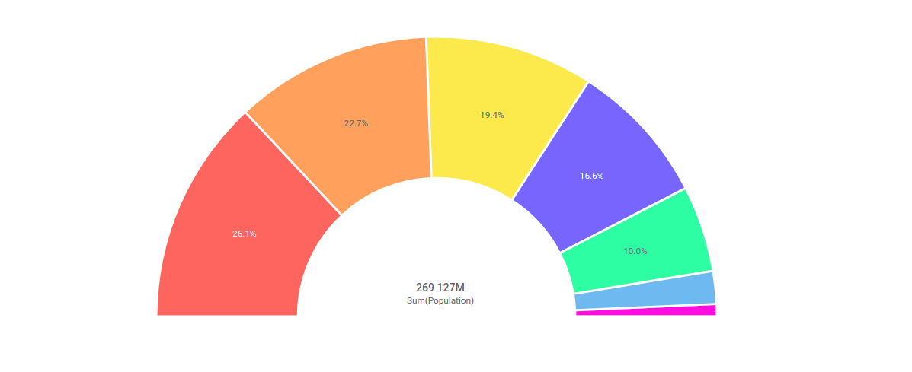

	A list with descriptions of the features and settings currently available in the mod is presented on this page. 

	
Content:

  
  
Features:

	<ol>
		<li style="font-size:1em;"><a href="#select-data">Selecting data</a></li>
		<li style="font-size:1em;"><a href="#drag-select">Click-hold-drag selection</a></li>
		<li style="font-size:1em;"><a href="#unselect">Unselect data</a></li>
    <li style="font-size:1em;"><a href="#mouseover-tooltip">MouseOver Tooltip</a></li>
    <li style="font-size:1em;"><a href="#center-text">Center text</a></li>
    <li style="font-size:1em;"><a href="#label-ratios">Label ratios</a></li>
    <li style="font-size:1em;"><a href="#negative-values">Negative values</a></li>
    <li style="font-size:1em;"><a href="#dynamic-visualization">Dynamic Visualization</a></li>
    <li style="font-size:1em;"><a href="#hover-effect">Outlined Hover on MouseOver</a></li>
    <li style="font-size:1em;"><a href="#settings-menu">Settings menu</a></li>
	</ol>

  
Settings:

  <ol>
		<li style="font-size:1em;"><a href="#show-labels">Show Labels For (...)</a></li>
		<li style="font-size:1em;"><a href="#show-in-labels">Show In Labels (...)</a></li>
    <li style="font-size:1em;"><a href="#labels-position">Labels Position (...)</a></li>
    <li style="font-size:1em;"><a href="#circle-type">Circle Type (...)</a></li>
	</ol>
  
   

Features:

<ul>
	<li id="select-data">Left Mouse and Ctrl-Clicking subsets of data.</li>
  
  
 Left Mouse clicking a subset of data will produce the highlighting of data seen in the chart on the left, whilst holding ctrl whilst clicking subsets of data will produce the highlighting on the right.

  
  <li id="drag-select">Click-hold-drag selection for multiple subsets.</li>
  
  
 Left Mouse holding and moving the mouse to cover the desired subsets, then releasing, will select all subsets that were present in the rectangular selection. 

  
  <li id="unselect">Unselect by clicking the mod background (canvas).</li>
  
  
 By clicking anywhere on the canvas, in this example the white background around the Chart, the selection as seen on the left, will be unselected and the mod will go back to looking like it does when no subsets are selected, as seen on the right. 

  
  <li id="mouseover-tooltip">Tooltip with dynamic information on mouseOver.</li>
  
  
 Hovering over a sector will create an outline of the sector, as well as display a tooltip with information about the sector that is currently being hovered. 

  
  <li id="center-text">Dynamic sum of values as center text.</li>
  
  
 The center text available in the mod will give relevant information about the data that is currently selected on the chart. Either the whole set, as seen to the right, or one to several subsets, as seen in the two rightmost images. 

  
  <li id="label-ratios">Labels showing ratios on each sector.</li>
  
  
 The labels inside the sectors tell the users which percentage of the data set is present inside the subset. 

  
  <li id="negative-values">Red lines visualizing negative values.</li>
  
  
 On the outer part of a sector, the red line indicates that a value is negative rather than positive. This is to help the user navigate negative and positive values more easily. 

  
  <li id="dynamic-visualization">Dynamic visualization based on sector and donut size.</li>
  
  
 Depending on the sizes of the sectors and the mod itself, different behaviours are expected within the Donut Chart. Some of these are the removal of labels when sectors are too small (middle) and the shortening of the center value name (right).

	
  <li id="hover-effect">Outlined hover-effect when hovering a sector.</li>
  
  
 When hovering a sector, as shown in the tooltip subsection, there is an outline present around the sector that you are currently hovering, which indicates the current sector.

  
  <li id="settings-menu">Settings for adapting different visualization aspects of the mod.</li>
  
  
 To change the way the mod is visualized, press the circled settings icon on the left, and a dropdown should appear of options that will change the look and placements of different aspects of your mod. Each of these settings are described underneath this section.
  
</ul>
 
 

Settings:

Show labels for:

<ul>
	<li>All</li>
  
  
 Selecting "Show labels for: All" will show labels for all sectors.
  
  
  <li>Marked rows</li>
  
  
 Selecting "Show labels for: Marked Rows" will show labels for all sectors that are marked, and none when no specific sector(s) have been marked.

	
  <li>None</li>
  
  
 Selecting "Show labels for: None" will display no labels for any sectors, wether they have been selected or not.

</ul>

Show in labels:

<ul>
	<li>Sector percentage</li>
  
  
 Selecting "Show in labels: Sector Percentage" will display the labels as a percentage.

	
  <li>Sector value</li>
  
  
 Selecting "Show in labels: Sector Value" will display the labels as the value of the corresponding sector.

	
  <li>Sector category</li>
  
  
 Selecting "Show in labels: Sector Category" will display the labels as the category of the current sector.

  
  <li>Multiple values</li>
  
  
 You can also select multiple different values when choosing how to display the sector values, for instance Sector Category and Sector Values at the same time, or any (or all) combinations of the settings in the following subsection.

</ul>

Labels position:

<ul>
	<li>Inside donut</li>
  
  
 Selecting "Labels position: Inside donut" will display the labels inside the Donut Chart.

  
  <li>Outside donut</li>
  
  
 Selecting "Labels position: Outside donut" will display the labels outside of the Donut Chart.

</ul>

Sorting:

<ul>
	<li>Sort sectors by size</li>
  
  
 Unselecting "Sorting: Sort sectors by size" will remove the sorting done by size on the sectors. It is important to note that this disables the following two settings, as well.

	
  <li>Sort sectors ascending</li>
  
  
 Selecting "Sorting: Sort sectors ascending" will sort the sectors in ascending order.

	
  <li>Sort sectors descending</li>
  
  
 Selecting "Sorting: Sort sectors descending" will sort the sectors in descending order.

</ul>

Circle type:

<ul>
	<li>Visualize whole circle</li>
  
  
 Selecting "Circle type: Visualize whole circle" will visualize the Donut Chart as a whole circle. </li>

  <li>Visualize semi-circle</li>
  
  
 Selecting "Circle type: Visualize semi-circle" will visualize the Donut Chart as a semi-circle. </li>
</ul>
 
